### 💫 About Me:
Sou licenciado em Engenharia e Gestão de Sistemas de Informação (LEGSI) pela Universidade do Minho, com forte interesse no desenvolvimento de soluções de software. Atualmente focado em aprofundar competências nos domínios da engenharia de dados e sistemas inteligentes, aplicando uma base analítica sólida na resolução de problemas complexos.

### 🌐 Socials:
 

### 💻 Tech Stack
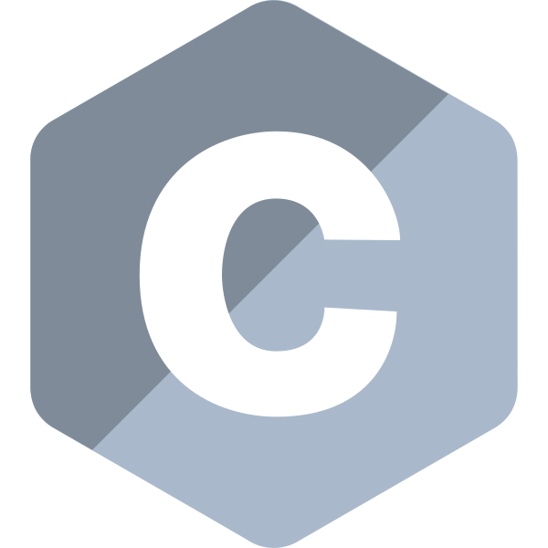 &nbsp; 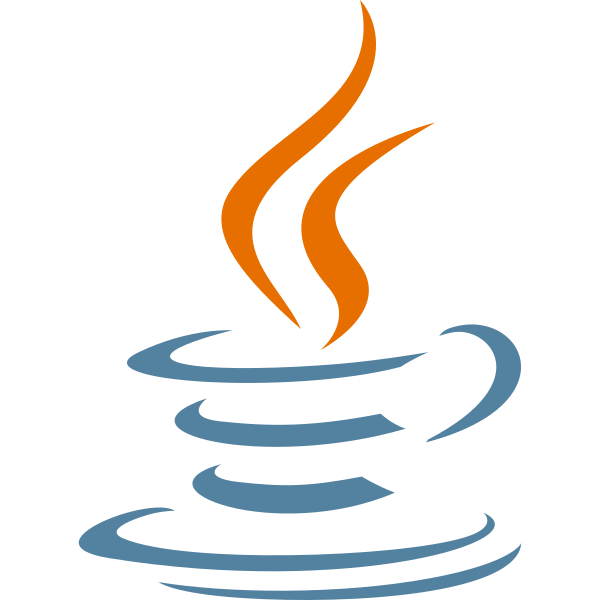 &nbsp;  &nbsp; 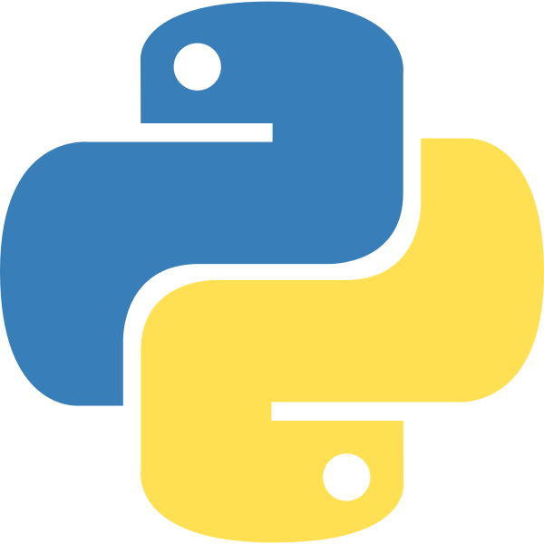 &nbsp;  &nbsp; 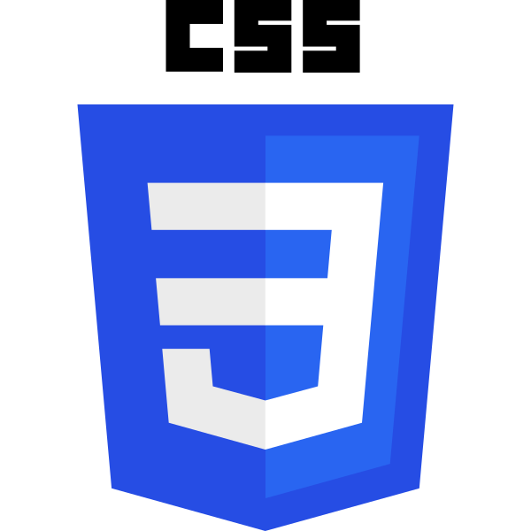 &nbsp; 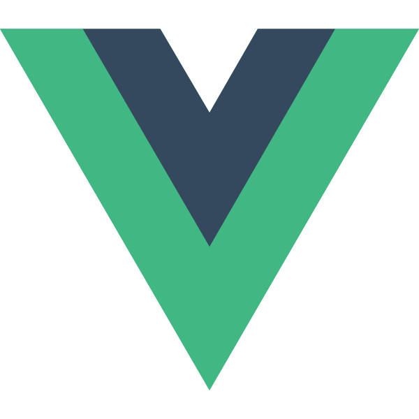 &nbsp;  &nbsp;  &nbsp;  &nbsp; 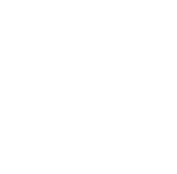 &nbsp; 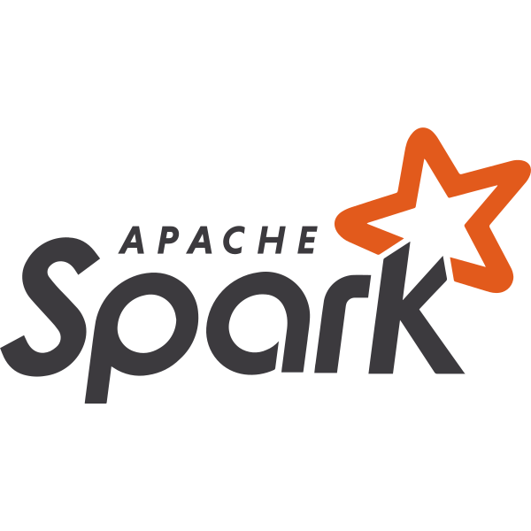 &nbsp;  &nbsp; 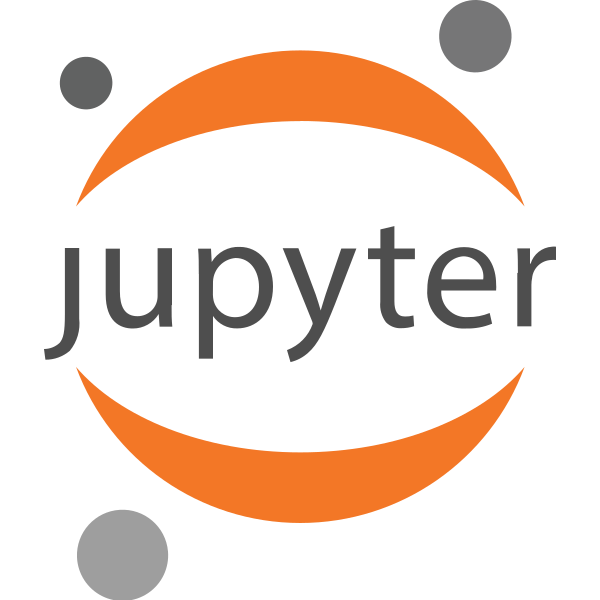 &nbsp; 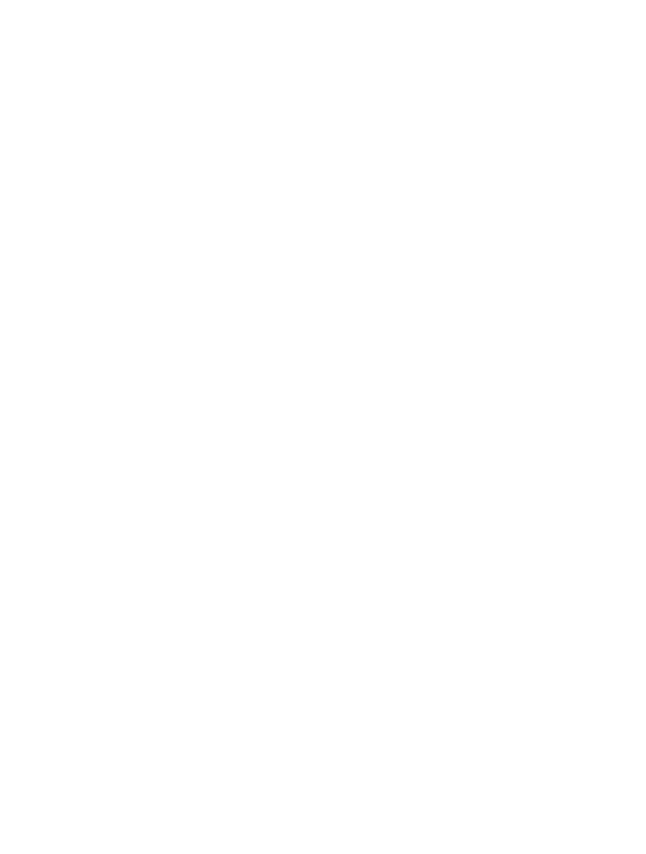 &nbsp; 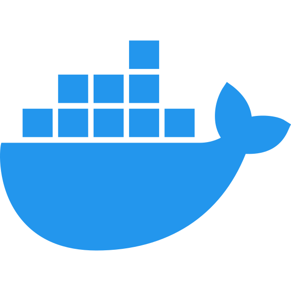 &nbsp; 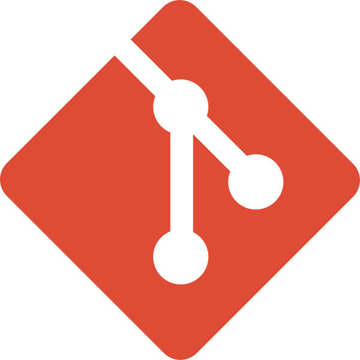 &nbsp; 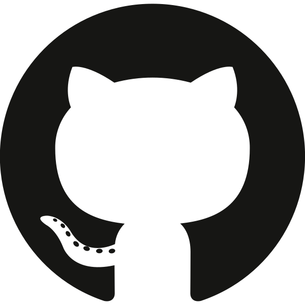 &nbsp;  &nbsp; 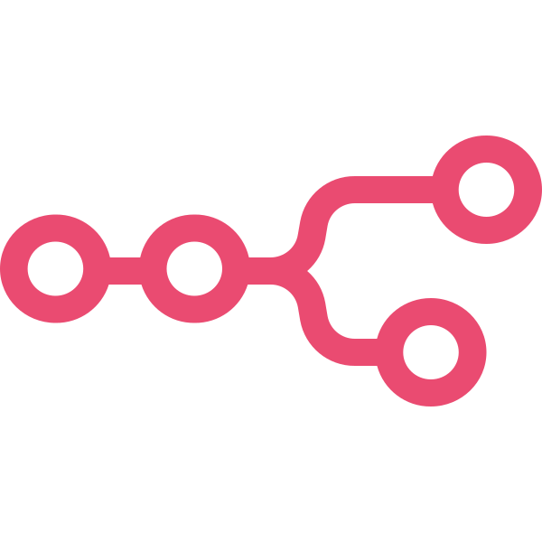

### 📊 GitHub Stats:

  
  &nbsp;&nbsp;&nbsp;
  

